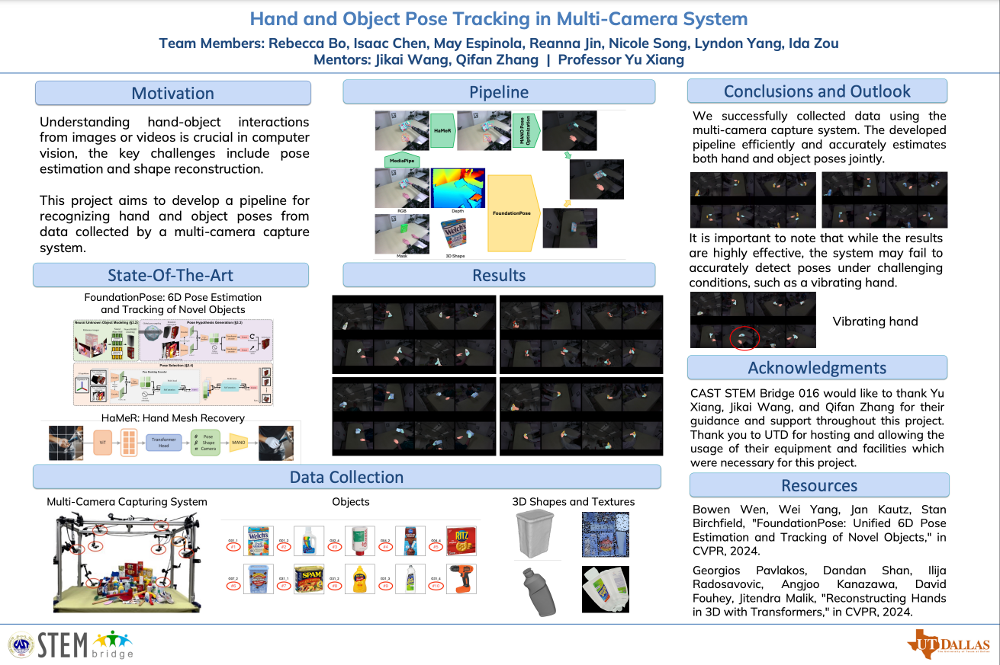
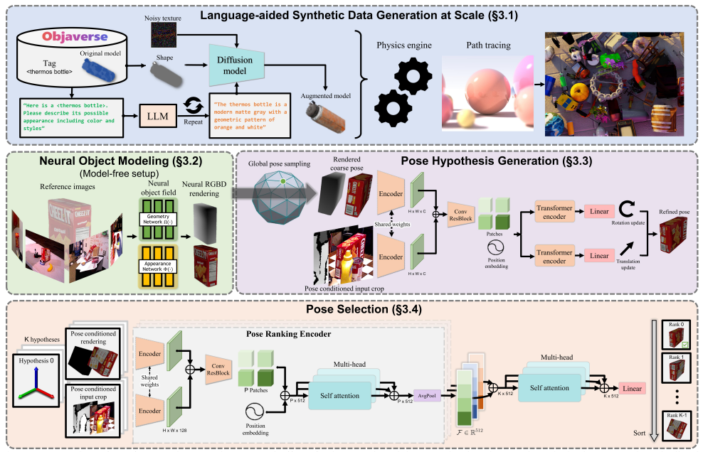

# CAST-STEM 2024 Summer Camp Project

[](https://www.python.org/downloads/release/python-3110) [](http://wiki.ros.org/melodic) [](https://pytorch.org/)  [](https://sites.google.com/view/016castbridge2024)

This is the repository for the CAST-STEM 2024 Summer Camp project. The project aims to estimate hand and object poses from recordings captured by the Multi-Camera System. The project website can be found [here](https://sites.google.com/view/016castbridge2024).

---

## Contents

- [CAST-STEM 2024 Summer Camp Project](#cast-stem-2024-summer-camp-project)
  - [Contents](#contents)
  - [Project Instruction Video](#project-instruction-video)
  - [Download Links](#download-links)
  - [License](#license)
  - [Prerequisites](#prerequisites)
  - [Environment Setup](#environment-setup)
  - [Project Schedule](#project-schedule)
    - [Week 1: Introduction to the Basics](#week-1-introduction-to-the-basics)
    - [Week 2: Data Collection (Calibration)](#week-2-data-collection-calibration)
    - [Week 3: Data Collection (Continued)](#week-3-data-collection-continued)
    - [Week 4: Data Processing (Handmarks \& Object Masks)](#week-4-data-processing-handmarks--object-masks)
    - [Week 5: Data Processing (Hand \& Object Pose Estimation)](#week-5-data-processing-hand--object-pose-estimation)
  - [Processed Results](#processed-results)

---



## Project Instruction Video

[](https://youtu.be/SmFpKeULE0Q)

Click on the image to watch the project instruction video.

## Download Links

- [Processed Results](https://utdallas.box.com/s/uge3jhx2livb9ns1mn5qe04w1j2dvsy3).
- [Final Presentation](https://utdallas.box.com/s/goe9nzqq7q5g1wz2nzhrrb34vbtbmu7f).

---

## License

This project is licensed under the GPL-3.0 License - see the [LICENSE](./LICENSE) file for details.

---

## Prerequisites

- Git

  - For Linux:

  ```bash
  sudo apt-get install git
  ```

  - For Windows:

    - Option One: [Github Desktop](https://desktop.github.com/).
    - Option Two: [Git for Windows](https://gitforwindows.org/).

  - For MacOS:

    - Option One: [Github Desktop](https://desktop.github.com/).
    - Option Two: [Homebrew](https://brew.sh/).

    ```bash
    /bin/bash -c "$(curl -fsSL https://raw.githubusercontent.com/Homebrew/install/HEAD/install.sh)"
    ```

- Conda Environment Manager

  Please refer to the official instruction [Installing Miniconda](https://docs.anaconda.com/miniconda/miniconda-install/) to install the miniconda.

- Code Editor (Visual Studio Code for example)

  - You could install the Visual Studio Code (VSCode) from the [official website](https://code.visualstudio.com/).
  - Once you have installed the VSCode, you could install below extensions:
    - [Python](https://marketplace.visualstudio.com/items?itemName=ms-python.python)
    - [Pylance](https://marketplace.visualstudio.com/items?itemName=ms-python.vscode-pylance)
    - [Python Debugger](https://marketplace.visualstudio.com/items?itemName=ms-python.debugpy)
    - [Jupyter](https://marketplace.visualstudio.com/items?itemName=ms-toolsai.jupyter)

## Environment Setup

1. Create the Conda Environment

```bash
conda create --name summer_camp python=3.11
conda activate summer_camp
```

2. Clone the Repository

```bash
git clone --recursive https://github.com/gobanana520/CAST-STEM-2024.git
cd CAST-STEM-2024
```

3. Install Dependencies

```bash
python -m pip install --no-cache-dir -r requirements.txt
```

4. ROS Environment Setup [Optional]

If you plan to run the ROS locally, refer to the [ROS Environment Setup](./docs/ROS_Environment_Setup.md) document for detailed steps. You can then run `roscore` to start the ROS master and debug your code under the ROS environment.

---

## Project Schedule

### Week 1: Introduction to the Basics

- **Slides**
  - :white_check_mark: [Pythion_Basics.ipynb](./notebooks/01_Python_Basics.ipynb)
    Introduce basics in Python, such as list, tuple, set, dictionary, class, function, loop, etc.
  - :white_check_mark: [Numpy_Basics.ipynb](./notebooks/02_Python_Numpy.ipynb)
    Introduce basics in Numpy, such as array, matrix, operation, etc.
  - :white_check_mark: [Pytorch_Basics.ipynb](./notebooks/06-1_Pytorch_Basics.ipynb)
    Introduce basics in Pytorch, such as tensor, operation, etc.
  - :white_check_mark: [ComputerVisionBasics.pdf](./docs/slides/01_ComputerVisionBasics.pdf)
    - Practice 1: [CV_Transformation.ipynb](./notebooks/03-3_CV_Transformation.ipynb)
      How to apply the transformation on 3D points.
    - Practice 2: [CV_Deprojection.ipynb](./notebooks/03-1_CV_Deprojection.ipynb)
      How to depreject the 2D depth image to 3D points.
    - Practice 3: [CV_Triangulation.ipynb](./notebooks/03-2_CV_Triangulation.ipynb)
      How to calculate the 3D points from 2D landmarks.
    - Practice 4: [SequenceLoader.ipynb](./notebooks/hw1_SequenceLoader.ipynb)
      Write a class to load the data from demo sequence.
  - :white_check_mark: [Introduction_to_ROS.pdf](./docs/slides/02_Introduction_to_ROS.pdf)
    Introduce the basic concepts and useful commands in ROS.
  - :white_check_mark: Slide: [Introduction_to_MANO.pdf](./docs/slides/03_Introduction_to_MANO.pdf)
    Introduce the basic concepts of parametric hand model MANO, and the Pytorch implementation of MANO ([Manopth](https://github.com/hassony2/manopth)).
    - Practice 5: [MANO_Hand.ipynb](./notebooks/05_MANO_Hand.ipynb)
      How to initialize the MANO layer and run the forward process.
  - :white_check_mark: [Introduction_to_Optimization.pdf](./docs/slides/04_Introduction_to_Optimization.pdf)
    Introduce the basic concepts of optimization and the optimization algorithms.
    - Practice 6: [MANO_Pose_Optimization.ipynb](./notebooks/06-2_MANO_Pose_Optimization.ipynb)
      How to use the Adam algorithm to optimize the MANO hand pose parameters to fit the target 3D joints.
- :books: **Readings**
  - :point_right: Highlights
    - Wiki: [RANSAC Algorithm](https://en.wikipedia.org/wiki/Random_sample_consensus)
      - Practice 7: Notebook: [RANSAC_Algorithm.ipynb](./notebooks/04_RANSAC_Algorithm.ipynb)
        A simple implementation of RANSAC algorithm.
    - ROS message Synchronization & Extraction
      - [Export image from rosbag](https://gist.github.com/zxf8665905/2d09d25da823b0f7390cab83c64d631a)
        A demo code of how to sync messages with `message_filters.ApproximateTimeSynchronizer()` from the rosbag file.
    - Link: [MediaPipe Handmarks Detection](https://ai.google.dev/edge/mediapipe/solutions/vision/hand_landmarker)
      Understand how to use MediaPipe to detect Handmarks from RGB images.
  - Methods will be used in the project
    - Hand Pose Estimation: [HaMeR](https://geopavlakos.github.io/hamer)
    - Object Pose Estimation: [FoundationPose](https://nvlabs.github.io/FoundationPose)
    - Image Segmentation: [Segment Anything](https://github.com/facebookresearch/segment-anything)
    - Video Object Segmentation: [XMem](https://hkchengrex.com/XMem)
  - Related Papers (Optional)
    - [SMPL Body Model](https://files.is.tue.mpg.de/black/papers/SMPL2015.pdf)
    - [SMPL-H Body Model](https://arxiv.org/abs/2201.02610)
    - [SMPL-X Body Model](https://arxiv.org/abs/1904.05866)
    - [HaMeR](https://arxiv.org/abs/2312.05251)
    - [FoundationPose](https://arxiv.org/abs/2312.08344)
    - [XMem](https://arxiv.org/abs/2207.07115)
    - [Segment Anything](https://arxiv.org/abs/2304.02643)

### Week 2: Data Collection (Calibration)

- **Tasks**

  - :white_check_mark: Camera Intrinsics Extraction

    - The camera intrinsics are saved under the `./data/calibration/intrinsics/<camera_serial>_640x480.json` file.

  - :white_check_mark: Camera Extrinsics Calibration

    - We use a large calibration board to calibrate the camera extrinsics in pairs. Below is the usage demo of the tool [Vicalib](https://github.com/arpg/vicalib):
      
    - The camera extrinsics are saved under the `./data/calibration/extrinsics/extrinsics_<data>/extrinsics.json` file.

  - :white_check_mark: Hand Shape Calibration.
    - The MANO hand shapes are saved under the `./data/calibration/mano/<person_id>/mano.json` file.
  - :white_check_mark: Get familiar with data collection with the Multi-Camera System.
    - Launch all the Realsense Cameras with ROS.
    - Use RVIZ to visualize the camera images.
    - Monitor the camera status.
    - Command to record the rosbag from specific topics.

### Week 3: Data Collection (Continued)

- **Objects Used in the Dataset**

  - The dataset contains the following objects:
    
  - The object models are saved under the `./data/models` folder. You could use [Meshlab](https://www.meshlab.net/) to view the object models.

- **Tasks**

  - :white_check_mark: Collect the data with the Multi-Camera System.
    - Each person will pick one object.
    - Use single / two hands to manipulate the object.
    - Recording is saved to the rosbag file.
  - :white_check_mark: Extract the images from the rosbag recordings.

- **Homeworks**
  - HW1: Rosbag Extraction
    - Write the class `RosbagExtractor`
      - to extract the images from the rosbag recordings for all the camera image topics.
    - the extracted images should be saved in the `./data/recordings/<person_id>_<rosbag_name>` folder following below structure
      ```
      <person_id>_<rosbag_name> # the recording folder name
      ├── 037522251142          # the camera serial number
      │   ├── color_000000.jpg  # the color image color_xxxxxx.jpg
      │   └── depth_000000.png  # the depth image depth_xxxxxx.png
      │   └── ...
      ├── 043422252387
      │   ├── color_000000.jpg
      │   ├── depth_000000.png
      │   ├── ...
      ├── ...
      ├── 117222250549
      │   ├── color_000000.jpg
      │   ├── depth_000000.png
      │   ├── ...
      ```
    - References:
      - [Export image from rosbag](https://gist.github.com/zxf8665905/2d09d25da823b0f7390cab83c64d631a)
  - HW2: Metadata Generation
    - For each extracted recording, the metadata should be generated under the sequence folder with filename `meta.json`.
    - The `object_id` (G01_1,...,G31_4) could be found in the [Week 3](#week-3-data-collection-continued) section.
    - Below is an example of the `meta.json` file:
      ```json
      {
        // the camera serial numbers
        "serials": [
          "037522251142",
          "043422252387",
          "046122250168",
          "105322251225",
          "105322251564",
          "108222250342",
          "115422250549",
          "117222250549"
        ],
        // the image width
        "width": 640,
        // the image height
        "height": 480,
        // the extrinsics folder name
        "extrinsics": "extrinsics_20240611",
        // the person name
        "mano_calib": "john",
        // the object id
        "object_ids": "G31_4",
        // the hand sides in the recording
        // (if both hands are used, the order should be right first and then left)
        "mano_sides": ["right", "left"],
        // the number of frames in the recording
        "num_frames": 1024
      }
      ```

### Week 4: Data Processing (Handmarks & Object Masks)

- **Slides**

  - [Introduction_to 6D Pose Estimation.pdf](./docs/slides/05_Introduction_to_6D_Pose_Estimation.pdf)
    - Understand what's 6D Object Pose Estimation.
    - Understand the pipeline of FoundationPose.
      
  - [Introduction to the HaMeR.pdf](./docs/slides/06_HaMeR.pdf)
    - Understand what's Large Vision Transformer (ViT) model, and how it works.
    - Understand the pipeline of HaMeR.
      

- **Tasks**

  - :white_check_mark: Handmarks Detection by MediaPipe
  - :white_check_mark: Label the initial Object Mask mannually.
  - :white_check_mark: Use XMem to generate the remaining masks for all the recordings.
  - :white_check_mark: Generate 3D hand joints by Triangulation and RANSAC.
  - :white_check_mark: Setup the HaMeR python environment.
  - :white_check_mark: Setup the FoundationPose python environment.

- **Homeworks**
  - HW1: Handmarks Detection
    - Write the class `MPHandDetector` to detect the 2D handmarks from the extracted images using the MediaPipe.
    - The detected handmarks should be saved in the `./data/recordings/<sequence_name>/processed/hand_detection` folder following below structure:
      ```
      <sequence_name>/processed/hand_detection
      ├── mp_handmarks_results.npz  # the detected handmarks results
      └── vis                       # the folder to save the visualization results
          ├── mp_handmarks
          │   ├── vis_000000.png    # the visualization image of the handmarks
          │   ├── vis_000001.png
          │   ├── ...
          └── mp_handmarks.mp4      # the visualization video of the handmarks
      ```
    - The detected handmarks should be saved as the numpy array with the shape of `(num_hands, num_joints, 2)`.
    - The detected handmarks should be saved in the image coordinate system and unnormalized.
    - The detected handmarks should be saved in the order of the right hand first, and then the left hand.
    - References:
      - [MediaPipe Handmarks Detection](https://ai.google.dev/edge/mediapipe/solutions/vision/hand_landmarker)
  - HW2: Label the initial Object Mask mannually.
    - The `mask_id` (1, 2,...,10) of each object could be found in the [Week 3](#week-3-data-collection-continued) section.
    - Dwonload the pretrained models [4.3GB] for Segment Anything Model (SAM).
      - For linux like OS: run `bash ./config/sam/download_sam_model.sh` in the terminal.
      - Or you could download the models from the [Box](https://utdallas.box.com/s/ve9ia13act2oos0s6k0mhbx6vhcj19ce) and put them under `./config/sam` folder.
    - Run the mask label toolkit to label the object mask in each camera view.
      ```bash
      python ./tools/04_run_mask_label_toolkit.py
      ```
      
      - Click `...` to select the image.
      - `Ctrl + Left Click` to add positive point (green color).
      - `Ctrl + Right Click` to add negative point (red color).
      - `R` to reset the points.
      - Click `-` and `+` to set the mask id, and click `Add Mask` to add the mask.
      - Click `Save Mask` to save the mask.
      - The mask and visualization images will be saved in the `./data/recordings/<sequence_name>/processed/segmentation/init_segmentation/<camera_serial>` folder.
    - HW3: Generate one 3D hand joint by triangulation and RANSAC.
      - Create the list of candidate 3D points by triangulation handmarks of each camera pair.
      - Use RANSAC to find the best 3D hand joint.
      - References:
        - [Triangulation.ipynb](./notebooks/03-2_CV_Triangulation.ipynb)
        - [RANSAC.ipynb](./notebooks/04_RANSAC_Algorithm.ipynb)
        - [Generate_3D_Handmarks_by_RANSAC.ipynb](./notebooks/07_Generate_3D_Handmarks_by_RANSAC.ipynb)

### Week 5: Data Processing (Hand & Object Pose Estimation)

- **Tasks**

  - :white_check_mark: Use the HaMeR to estimate the 2D handmarks in each camera view.
    - Generate the input bounding box for the HaMeR.
    - Run HaMeR model to estimate the 2D handmarks.
  - :white_check_mark: Use the FoundationPose to estimate the object pose in each camera view.
    - Setup the FoundationPose python environment.
    - Write the `DataReader` to load the input data for the FoundationPose for our sequences.
    - Run the FoundationPose model to estimate the object pose.
  - :white_check_mark: Optimize the final MANO hand pose.
    - Generate 3D hand joints from handmarks of HaMeR.
    - Optimize the MANO hand pose to fit the 3D hand joints.
  - :white_check_mark: Optimize the final Object Pose.
    - Generate the best 3D object pose from the FoundationPose results.
    - Optimize the object pose to fit the 3D inlier FD poses.
  - :white_check_mark: Generate the final 3D hand and object poses.
    - Generate the final hand and object poses from the optimized MANO hand pose and object pose.
      - The final MANO hand poses is save to `poses_m.npy` file under each sequence folder.
      - The final 6D object poses is save to `poses_o.npy` file under each sequence folder.
  - :white_check_mark: Visualization of the final poses
    - The rendered images are saved in the `./data/recordings/<sequence_name>/processed/sequence_rendering` folder. And
    - Tthe rendered video is saved to `vis_<sequence_name>.mp4` file under each sequence folder.

- **Homeworks**
  - HW1: Run FoundationPose Model on our sequences.
    - Write the code to run FoundationPose on our dataset.
    - References:
      - Notebook: [Run_Foundation_Pose_for_Summer_Camp.ipynb](./notebooks/08_run_foundation_pose_for_summer_camp.ipynb)
  - HW2: Run HaMeR Model on our sequences.
    - Write the code to run HaMeR on our dataset.
    - References:
      - Notebook: [Run_HaMeR_for_Summer_Camp.ipynb](./notebooks/09_run_hamer_for_summer_camp.ipynb)

---

## Processed Results

Videos demonstrating the final processed results of the project can be found below:

<div style="display: flex; flex-direction: column; gap: 0;">
  <div style="flex: 1 1 100%; max-width: 100%;">
    
  </div>
  <div style="flex: 1 1 100%; max-width: 100%;">
    
  </div>
  <div style="flex: 1 1 100%; max-width: 100%;">
    
  </div>
  <div style="flex: 1 1 100%; max-width: 100%;">
    
  </div>
  <div style="flex: 1 1 100%; max-width: 100%;">
    
  </div>
  <div style="flex: 1 1 100%; max-width: 100%;">
    
  </div>
  <div style="flex: 1 1 100%; max-width: 100%;">
    
  </div>
</div>
